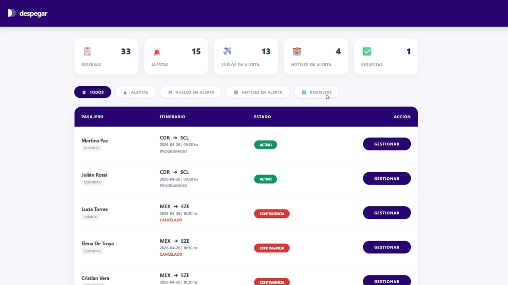
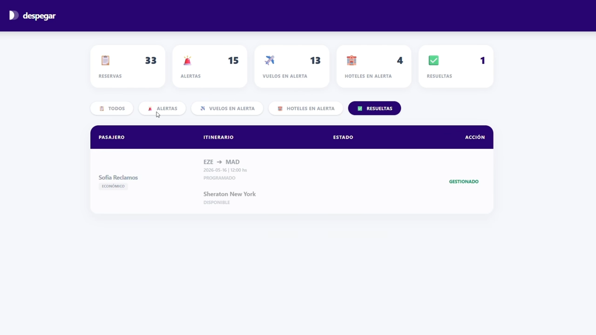
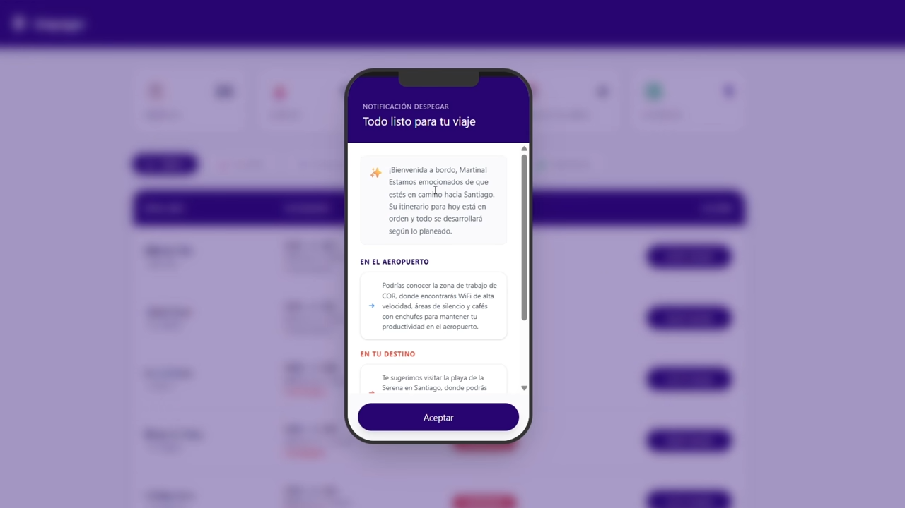
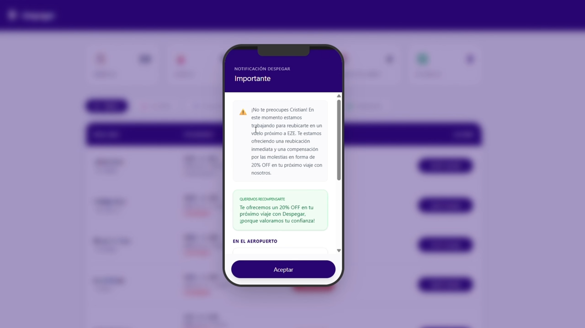

# Asistente de Postventa con IA

Un proyecto Full Stack desarrollado con la iniciativa de resolver uno de los mayores desafíos en la industria del turismo: la experiencia del cliente ante cancelaciones, demoras o cambios inesperados en sus viajes.

### Imágenes del proyecto

  
  
  
  

### Tecnologías utilizadas
- **Backend:** Java, Spring Boot
- **Frontend:** React.js, TypeScript, Tailwind CSS
- **Inteligencia Artificial:** Python, FastAPI, LLama 3.1

### Habilidades 
- **Iniciativa & Proactividad:** Diseño y desarrollo de una solución desde cero inspirada en las problemáticas reales de una Big Tech de turismo.
- **Enfoque Product-Driven:** Creación de software orientado directamente a mejorar la experiencia del usuario y mitigar el impacto operativo de las contingencias.
- **Integración de IA:** Implementación de modelos de lenguaje para la personalización masiva de soluciones según el perfil de cada viajero.
- **Arquitectura Full Stack:** Conexión fluida entre una interfaz reactiva, un backend robusto y un microservicio de IA optimizado.

### Funcionalidades principales
- **Detección y Gestión de Contingencias:** Procesamiento de alertas críticas como cancelaciones de vuelos, demoras operativas o cambios imprevistos de hotel.
- **Motor de Compensaciones de Cortesía:** Automatización inteligente en la asignación de vouchers, reembolsos o beneficios alternativos inmediatos.
- **Sugerencias Personalizadas con IA:** Análisis del perfil del viajero para ofrecer soluciones adaptadas y empáticas al contexto.
